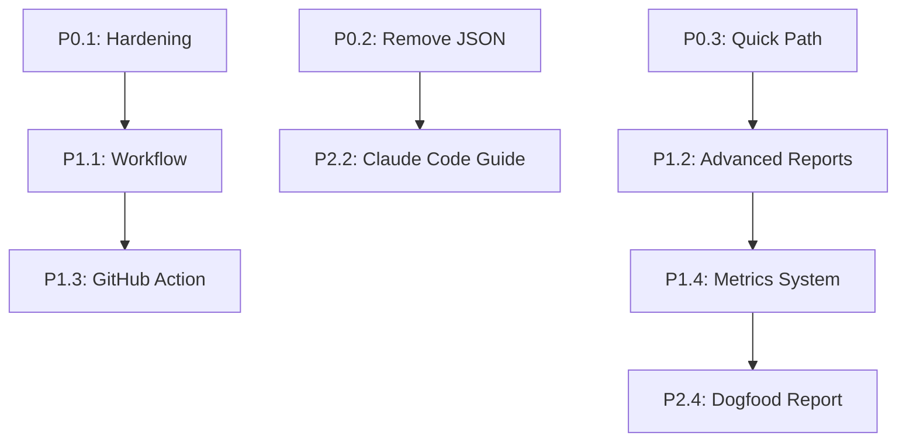

# Code Guardian Studio - Product Roadmap

**Generated**: 2025-12-05
**Status**: Active Development
**Goal**: Transform CCG from "interesting tool" to "must-have for teams doing serious refactoring"

---

## 🎯 Strategic Objectives

### Primary Goals
1. **Free tier**: Make onboarding effortless (< 10 min quickstart)
2. **Team tier**: Prove clear value over SonarQube + Claude manual prompts
3. **ROI proof**: Demonstrate measurable tech debt reduction

### Success Metrics
- **Adoption**: 100+ GitHub stars → 500+ within 3 months
- **Conversion**: 5% free → Team tier conversion
- **Retention**: 80%+ Team tier monthly retention
- **NPS**: Developer NPS > 40

---

## 🚀 P0: Immediate Priorities (Week 1-2)

These tasks **must** be completed to make free tier compelling.

### 1. Hardening Free Tier Experience
**Priority**: Critical
**Estimated tokens**: 15,000
**Owner**: TBD
**Files**: `docs/USER_GUIDE.md`, `src/bin/ccg.ts`, `tests/integration/quickstart.test.ts`

**Objective**: New user can go from zero to first report in < 10 minutes without license.

**Subtasks**:
1. **Write E2E integration test** (Analysis phase)
   - Clone 20-30k LOC OSS repo (e.g., express.js)
   - Run: `ccg init && ccg code-optimize --report`
   - Assert: No crashes, report.md generated, hotspots JSON exists
   - Tools: `testing_run`
   - Est: 2,000 tokens

2. **Reduce CLI complexity** (Plan phase)
   - Create "Quick Analysis" preset (default)
   - Only show advanced flags in `--help-advanced`
   - Tools: `thinking_get_model`
   - Est: 1,500 tokens

3. **Implement quickstart command** (Impl phase)
   - Add: `ccg quickstart --interactive`
   - Wizard asks: repo type, optimization goal
   - Auto-runs first scan
   - Tools: `latent_apply_patch`, `guard_validate`
   - Est: 3,000 tokens

4. **Polish docs** (Impl phase)
   - Remove ALL JSON examples from USER_GUIDE.md
   - Add "3-minute tutorial" section
   - Tools: `documents_update`
   - Est: 1,500 tokens

5. **Verify on 3 repos** (Review phase)
   - Test on: small (5k LOC), medium (30k LOC), large (100k+ LOC)
   - Ensure < 10 min for small/medium
   - Tools: `testing_run`
   - Est: 2,000 tokens

**Success criteria**:
- ✅ Integration test passes on CI
- ✅ Zero JSON visible in quickstart docs
- ✅ Completes in < 10 min for 30k LOC repo
- ✅ Works without license key

---

### 2. Remove JSON Hell from UX
**Priority**: Critical
**Estimated tokens**: 8,000
**Owner**: TBD
**Files**: `docs/USER_GUIDE.md`, `docs/FLOW_AND_USE_CASES.md`, `README.md`, `src/bin/commands/*.ts`

**Objective**: Users see ONLY natural language, never JSON tool schemas.

**Subtasks**:
1. **Audit all docs** (Analysis phase)
   - Scan for: `{`, `"title":`, tool schemas
   - Mark locations for removal/annotation
   - Tools: `documents_search`, `Grep`
   - Est: 1,500 tokens

2. **Update docs** (Impl phase)
   - Replace JSON examples with:
     ```
     # ❌ Don't show users:
     {"title": "Refactor auth", "goal": "readability"}

     # ✅ Show instead:
     "Create task to refactor auth module for readability"
     ```
   - Add note: "JSON is internal format - Claude handles this"
   - Tools: `documents_update`
   - Est: 3,000 tokens

3. **Update CLI help** (Impl phase)
   - Change `ccg --help` examples from JSON to natural language
   - Move schema docs to AGENTS.md only
   - Tools: `Edit`
   - Est: 2,000 tokens

4. **Final verification** (Review phase)
   - grep -r "{\s*\"" docs/ → should return 0 user-facing hits
   - Tools: `Grep`
   - Est: 500 tokens

**Success criteria**:
- ✅ Zero JSON in USER_GUIDE.md, README.md, FLOW_AND_USE_CASES.md
- ✅ CLI help shows only natural language
- ✅ Tool schemas only in AGENTS.md / internal docs

---

### 3. Implement Quick Path Routing
**Priority**: Critical
**Estimated tokens**: 12,000
**Owner**: TBD
**Files**: `src/bin/ccg.ts`, `src/modules/commands.service.ts`, `src/modules/latent.service.ts`, `docs/USER_GUIDE.md`

**Objective**: Simple queries respond in 5-10s, not 30-60s due to multi-agent overhead.

**Subtasks**:
1. **Map command categories** (Analysis phase)
   - **Quick path**: `explain`, `quick-fix`, `analyze-file`
   - **Heavy path**: `code-optimize`, `refactor-plan`
   - Tools: `documents_search`
   - Est: 1,500 tokens

2. **Design router logic** (Plan phase)
   ```typescript
   // Pseudocode:
   if (command in ['explain', 'quick-fix']) {
     // Direct tool call, no Latent Chain
     return await directToolExecution(command, args);
   } else {
     // Full workflow with agents
     return await latentChainWorkflow(command, args);
   }
   ```
   - Tools: `thinking_get_model`
   - Est: 2,000 tokens

3. **Implement router** (Impl phase)
   - Create `CommandRouter` class
   - Add latency tracking per command type
   - Tools: `latent_apply_patch`, `guard_validate`
   - Est: 4,000 tokens

4. **Update docs with latency expectations** (Impl phase)
   - Add table:
     | Command | Path | Expected Time |
     |---------|------|---------------|
     | explain | Quick | 5-10s |
     | code-optimize | Heavy | 1-3min |
   - Tools: `documents_update`
   - Est: 1,000 tokens

5. **Benchmark and verify** (Review phase)
   - Run `ccg explain <file>` → should be < 10s
   - Run `ccg code-optimize` → can take minutes
   - Tools: `testing_run`
   - Est: 1,500 tokens

**Success criteria**:
- ✅ Quick commands complete in 5-10s
- ✅ Heavy commands can use full workflow
- ✅ Docs clearly state expected latency per command
- ✅ No multi-agent overkill on simple queries

---

## 🎯 P1: Team Tier Differentiation (Week 3-6)

These tasks prove Team tier is worth $39/mo.

### 4. Stabilize Code Optimization Workflow
**Priority**: High
**Estimated tokens**: 20,000
**Tags**: `team-tier`, `workflow`, `reliability`

**Objective**: Analysis → Plan → Impl → Review pipeline runs crash-free on diverse repos.

**Success criteria**:
- ✅ Runs on 3 repos (React SPA, Node.js API, Python monorepo) without crashes
- ✅ Full session logging to `.ccg/sessions/<id>.json`
- ✅ Each phase transition logged with timestamp

---

### 5. Build Advanced Reports (Team tier)
**Priority**: High
**Estimated tokens**: 15,000
**Tags**: `team-tier`, `reports`, `monetization`

**Objective**: Team tier gets before/after metrics, session history, ROI proof.

**Features**:
- **Before/after metrics**:
  ```markdown
  ## Tech Debt Summary
  Before: 120 hotspot points across 20 files
  After: 80 hotspot points across 15 files (-33%)

  Time saved: ~8 hours of manual review
  ```

- **Session history**:
  - List all sessions with date, files touched, outcome
  - Filter by repo, date range

- **License gating**:
  ```typescript
  if (license.tier !== 'team') {
    // Show basic report only
    return basicReport(hotspots);
  }
  // Show advanced report
  return advancedReport(hotspots, metrics, sessions);
  ```

**Success criteria**:
- ✅ Advanced reports gated by license check
- ✅ Before/after comparison shows real metrics
- ✅ Session history persisted and queryable

---

### 6. GitHub Action + PR Comments
**Priority**: High
**Estimated tokens**: 18,000
**Tags**: `team-tier`, `ci-cd`, `github`

**Objective**: Auto-comment hotspots on PRs, show value in CI workflow.

**Deliverables**:
1. **GitHub Action template** (`.github/workflows/ccg-pr-check.yml`)
   ```yaml
   name: Code Guardian PR Check
   on: pull_request
   jobs:
     analyze:
       runs-on: ubuntu-latest
       steps:
         - uses: actions/checkout@v3
         - run: npm i -g @anthropic-community/claude-code-guardian
         - run: ccg code-optimize --ci --threshold 80
         - uses: actions/github-script@v6
           with:
             script: |
               // Post hotspots as PR comment
               const report = require('./ccg-report.json');
               github.rest.issues.createComment({
                 issue_number: context.issue.number,
                 body: formatReport(report)
               });
   ```

2. **PR comment formatter**:
   ```markdown
   ## 🔍 Code Guardian Analysis

   Found **3 hotspots** in this PR:

   | File | Score | Issue | Suggestion |
   |------|-------|-------|------------|
   | src/auth.ts | 87 | 450 lines | Split into AuthService + SessionManager |
   | src/api.ts | 83 | Complexity 62 | Extract validation logic |

   [View full report](./ccg-report.md)
   ```

**Success criteria**:
- ✅ GitHub Action runs on PR open/update
- ✅ Posts formatted comment with top 5 hotspots
- ✅ Tested on 2 real repos (public + private)

---

### 7. Tech Debt Metrics System
**Priority**: High
**Estimated tokens**: 12,000
**Tags**: `metrics`, `roi`, `team-tier`

**Objective**: Calculate and track "tech debt index" over time.

**Metrics to track**:
1. **Hotspot count**: Total files with score > 70
2. **Total hotspot score**: Sum of all hotspot scores
3. **Avg complexity**: Average of top 10 files
4. **Files > threshold**: Count of files > 500 lines OR complexity > 50

**Implementation**:
```typescript
interface TechDebtSnapshot {
  timestamp: Date;
  repoName: string;
  hotspotsCount: number;
  totalScore: number;
  avgComplexity: number;
  filesOverThreshold: number;
  index: number; // Composite: (score + count + avg) / 3
}

// Store before/after snapshots per session
class MetricsService {
  async captureSnapshot(repo: string): Promise<TechDebtSnapshot>;
  async compareSnapshots(before: Snapshot, after: Snapshot): Promise<Report>;
}
```

**Display in report**:
```markdown
## 📊 Tech Debt Trend

Session 1 (Dec 1): Index 85 ████████░░
Session 2 (Dec 3): Index 72 ███████░░░ (-15%)
Session 3 (Dec 5): Index 58 ██████░░░░ (-32% total)

✨ You saved ~12 hours of manual review this month
```

**Success criteria**:
- ✅ Metrics calculated per session
- ✅ Before/after comparison shows % improvement
- ✅ Trend visualization in Team tier reports

---

## 🔧 P2: DX Polish & Scale (Week 7-12)

These tasks improve developer experience and enable scale.

### 8. Multi-repo Configuration
**Priority**: Medium
**Estimated tokens**: 10,000
**Tags**: `config`, `multi-repo`, `team-tier`

**Objective**: Manage 10+ repos from single config file.

**Config format** (`.ccg/config.yml`):
```yaml
repos:
  - name: monorepo-core
    path: .
    rules:
      threshold: 80
      exclude: ["node_modules", "dist"]

  - name: payments-service
    path: ../payments
    rules:
      threshold: 70

  - name: auth-service
    path: ../auth
```

**CLI commands**:
```bash
ccg list-repos
ccg code-optimize --repo payments-service
ccg report --all-repos
```

**Success criteria**:
- ✅ Config parser validates YAML
- ✅ Session tracking per repo
- ✅ CLI supports `--repo` flag

---

### 9. Claude Code Integration Guide
**Priority**: Medium
**Estimated tokens**: 8,000
**Tags**: `docs`, `claude-code`, `integration`

**Deliverables**:
1. **CLAUDE_CODE_QUICKSTART.md**:
   - How to add CCG MCP server to Claude Code
   - Prompt templates for common workflows
   - Boilerplate `.claude/config.json`

2. **Example prompts**:
   ```
   "Use Code Guardian Studio to scan this repo and find top 10 hotspots"

   "Run code optimization workflow on src/auth/ module"

   "Generate refactor plan for the files with highest complexity"
   ```

**Success criteria**:
- ✅ Guide tested with Claude Code v1.x
- ✅ MCP server config works copy-paste
- ✅ Prompt templates produce expected results

---

### 10. VS Code Extension Scaffold
**Priority**: Medium
**Estimated tokens**: 15,000
**Tags**: `vscode`, `ide`, `extension`

**Objective**: Minimal extension that wraps CLI and shows reports in editor.

**Features**:
1. **Command palette**:
   - "CCG: Scan Current File"
   - "CCG: Optimize Repository"
   - "CCG: View Report"

2. **Hover tooltips** (stretch goal):
   - Hover over function → show: "⚠️ Hotspot #3 (Score: 87)"

3. **Report viewer**:
   - Open `.ccg/reports/latest.md` in VS Code markdown preview

**Tech stack**:
- Extension API: VS Code Extension API
- CLI wrapper: Node.js `child_process.exec`
- No LLM needed (just UI bridge)

**Success criteria**:
- ✅ Extension published to VS Code Marketplace
- ✅ Can run CLI commands from Command Palette
- ✅ Opens reports in editor

---

### 11. Dogfood Report Generator
**Priority**: Medium
**Estimated tokens**: 10,000
**Tags**: `dogfooding`, `case-study`, `marketing`

**Objective**: Auto-generate case study from CCG's own usage on itself.

**Script** (`scripts/dogfood-report.ts`):
```typescript
// Run CCG on itself over date range
const sessions = await runCodeOptimize({
  repo: '.',
  dateRange: { start: '2024-12-01', end: '2024-12-31' }
});

// Combine metrics
const report = {
  totalSessions: sessions.length,
  filesTouched: [...new Set(sessions.flatMap(s => s.files))],
  beforeIndex: sessions[0].metrics.index,
  afterIndex: sessions[sessions.length - 1].metrics.index,
  improvement: ((before - after) / before * 100).toFixed(1) + '%',
  estimatedTimeSaved: sessions.length * 2 // 2h per session avg
};

// Generate Markdown
await fs.writeFile('CASE_STUDY_INTERNAL.md', formatReport(report));
```

**Output**: Markdown skeleton for public case study.

**Success criteria**:
- ✅ Script runs monthly automatically
- ✅ Generates real metrics from CCG's own repo
- ✅ Used as source for marketing case studies

---

## 📊 Tracking & Metrics

### Task Status Dashboard
View current status: `ccg workflow status`

**As of 2025-12-05**:
- **P0 tasks**: 3 pending, 0 in progress, 0 completed
- **P1 tasks**: 4 pending, 0 in progress, 0 completed
- **P2 tasks**: 4 pending, 0 in progress, 0 completed
- **Total estimated tokens**: 115,000

### Dependencies



---

## 🎬 Next Steps

1. **Week 1**: Start P0.1 (Hardening) - highest impact
2. **Week 2**: Parallel P0.2 (Remove JSON) + P0.3 (Quick Path)
3. **Week 3-4**: Begin P1 tasks once P0 complete
4. **Week 5-6**: Focus on metrics + GitHub integration
5. **Week 7+**: Polish with P2 tasks

**First task to start**: `P0.1: Hardening Free Tier Experience`

Run: `ccg workflow start c6bdb3ab-c22d-4169-995d-7809db13ea5b`

---

## 📝 Notes

- All tasks tracked in CCG's own workflow system (dogfooding!)
- Token estimates based on CCG's auto_decompose_task analysis
- Success criteria must be verified before marking task complete
- Plan will evolve based on user feedback and metrics

**Last updated**: 2025-12-05
**Status**: Ready to execute
